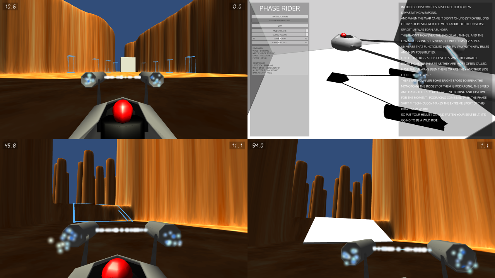

# Phase Rider - Ludum Dare 30

A podracing game with phase shift. Instructions and Lore in the menu. Only one level (even though there is a disabled menu option).  

My entry to the 30:th Ludum Dare game jam (theme: Connected Worlds), following the compo rules (alone, from scratch, 48 hours).

[Download the game here](https://github.com/Aggrathon/LudumDare30/releases) or [check out the Ludum Dare entry](http://ludumdare.com/compo/ludum-dare-30/?action=preview&uid=37874)  (link dead)!

## Technical Info

Made with Unity beta to test the new UI (and wasted too much time...). Tested on Windows and on Linux (installation of some additional 32bit libraries required on a 64bit system)

## Screenshots

